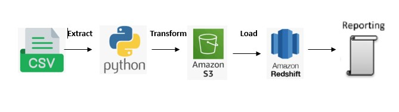

#### ABC General Hospital - **Extract Transform Load**

<table><tr><td align="center"></tr></td></table>

## ABC General Hospital Project
This project implements a data pipeline for extracting, transforming, and loading (ETL) data from CSV files to Amazon Redshift using Python. It consists of several functions that perform different tasks.

**At the end of ETL process, the prepared data would have answered these questions and more:**
 * Number of patient visits
 * Institution visits status (Active, Inactive, At Rist, Churned)

## Prerequisites

 * Libraries: pandas, boto3, redshift_connector
 * Amazon Redshift Cluster
 * AWS S3 Bucket

## Setup

* 1. Install required libraries
* 2. Update the secret.py file with your AWS access and secret keys.
** secrets = {'aws_access_key_id': 'your_access_key','aws_secret_access_key': 'your_secret_key'}
* 3. Create a Redshift configuration file redshift.py
    redshift_cred = {
    'host': 'your_redshift_host',
    'user': 'your_redshift_user',
    'password': 'your_redshift_password'
    }
 

**How ETL works** : Lets understand each step of the ETL process and how the functions works

## extract_data : 
Function to read data from two CSV files.
**Parameters :**
* file_pattern (str): File pattern to match multiple CSV files.
* file_pattern (str): File pattern to match multiple CSV files.
**Returns :**
* pd.DataFrame: Two DataFrames containing the data from the CSV files.

## transform_data:
Transforms data by merging DataFrames and perform data cleaning which include:

* Deduplication
* dropping unnecessary columns
* Remove leading and trailing whitespaces from 'institution_id' columns
* Formatting the data into tables or joined tables

## upload_file_to_s3 : 
Function upload a file to an S3 bucket.
**Parameters :**
* file_name (str): File to upload
* bucket (str): Bucket to upload to
*  object_name (str): S3 object name. If not specified then file_name is used
**Returns :**
*  bool: True if file was uploaded, else False

## Error Handling:
* Each function has basic error handling for common exceptions related to file operations, data processing, and Redshift connections. Errors are logged for review.